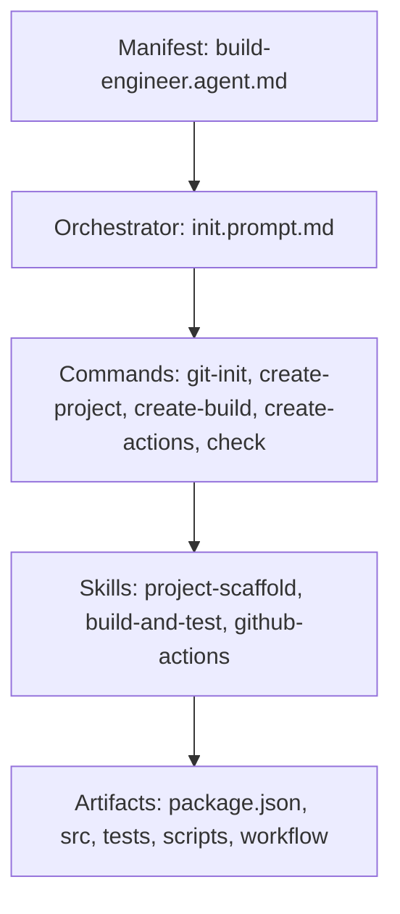

# Архітектура AI-агента

## Призначення

Репозиторій містить інфраструктуру AI-агента для підготовки JavaScript-проєкту з npm scripts, Jest і GitHub Actions. Файли агента відокремлені від майбутнього коду застосунку та тестів.

## Компоненти

- **Manifest** описує роль Build Engineer Agent, обмеження, доступні скіли та критерії завершення.
- **Orchestrator** задає порядок виконання й політику Fail-Fast.
- **Commands** є вузькими prompt-контрактами для окремих етапів.
- **Skills** містять процедури, входи, результати, перевірки та обробку помилок.
- **Artifacts** — результат роботи оркестратора: проєкт, тести та CI-конфігурація.

## Потік артефактів

1. `git-init` готує правила відстеження та захищає репозиторій від секретів і кешів.
2. `create-project` створює npm manifest, entry point, README та базові scripts.
3. `create-build` додає Jest, тест `BasicAddition` і build/test scripts.
4. `create-actions` переносить локальні перевірки в `ci.sh`, `ci.bat` і matrix workflow.
5. `check` перевіряє структуру та запускає команди без модифікації файлів.

Кожний крок передає наступному вже перевірений стан. Помилка зупиняє потік, тому несправний артефакт не використовується далі.
